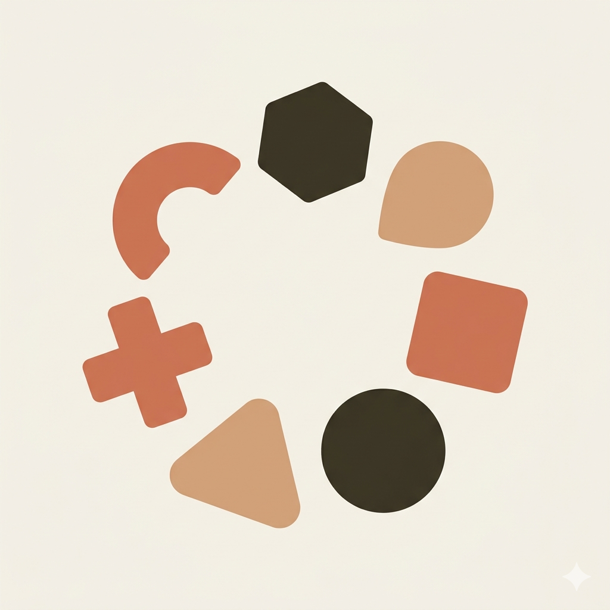
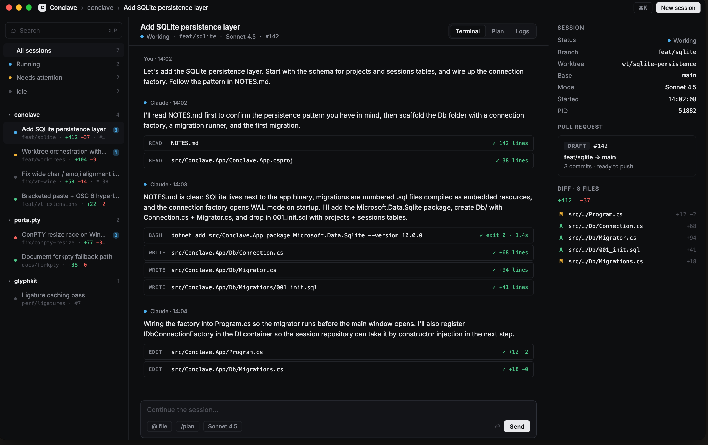

<h1>
  
  Conclave
</h1>

**A desktop home for your Claude Code sessions — many at once, each in its own git worktree.**



---

## Why

Running `claude` in a terminal is great for one session. It stops scaling the
moment you want two — branches collide, prompts get lost between tabs, and
there's no shared view of what each agent is up to.

Conclave gives every Claude its own workspace, its own transcript, and its
own live status — all in one window. Spin up parallel sessions across
projects, follow what every agent is doing, and stop juggling branches by
hand.

## What you get

- **Parallel sessions, one window.** Group by project, filter by *running*,
  *needs attention*, or *idle*. Jump between agents without losing your
  place.
- **A worktree per session.** New sessions run `git worktree add` for you,
  so branches never step on each other and you never have to stash again.
- **Live status at a glance.** Working, waiting, running a tool, idle, or
  errored — visible from the sidebar without opening the session.
- **Transcript, Plan, Logs.** Three views per session. The plan view turns
  Claude's `TodoWrite` into a real progress checklist; logs keep lifecycle
  events out of your transcript.
- **Embedded terminal.** Colors, paging, and most TUIs work out of the box.
- **Pull request card.** Once the branch is pushed, Conclave picks the
  linked PR up from `gh` and shows status, diff, and base alongside the
  session.
- **Themed in from day one.** Dark and light, five accents, tunable
  density and corner radius — not bolted on later.

## Try it

You'll need:

- **.NET 10 SDK**
- **macOS, Linux, or Windows**
- **`claude` CLI** on `PATH` for real sessions
- **`git`** on `PATH`, and **`gh`** if you want PR cards

Run from source:

```sh
dotnet restore
dotnet run --project src/Conclave.App
```

Or build a native binary:

```sh
dotnet publish src/Conclave.App -c Release
```

## Status

Active development. The shell, embedded terminal, and per-session plumbing
are wired up; a few items in [`PHASE_4.md`](./PHASE_4.md) — transcript
persistence across restarts, live diff stats, the cancel button, and the
permission modal — are still in flight. Expect rough edges.

## License

MIT — see [`LICENSE`](./LICENSE).
